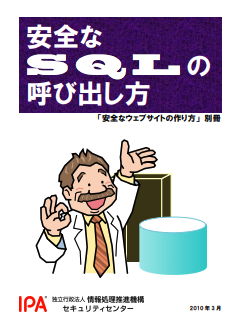
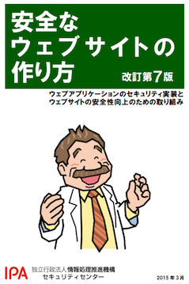

# セキュリティ基礎
## セキュアコーディング入門

---

# 自己紹介

* 名前: 高橋雄紀 @takapi86
* 所属: EC事業部 カラーミーショップグループ DXチーム
  * 開発基盤の改善、セキュリティ改善など

---

# 講義の形式
* 質問がある場合はチャットにコメントをお願いします
  * 質問ではなくて、感想などでもOK
* 基本は座学で進め講義を行い、デモは動画で流します

---

# セキュアコーディングとは

攻撃者やマルウェアなどの攻撃に耐えられる、堅牢なプログラムを書くこと

* 今回はWebのアプリケーションのセキュアコーディングについてお話していきます。

---

# なぜセキュアコーディングを学ぶのか

## 我々はWebサービスの開発を行っており、日常的にプログラム修正・リリースを行っている
- リリースを行うということは、サービスに変更を加えている
- 今現在、セキュリティ的に問題ないとしても、リリースを行い変更を加えることによって脆弱性が混入するかもしれない
- 日々の開発で脆弱性が混入しないよう、セキュアコーディングを覚えることが大事

---

# 今回学ぶこと

Webアプリケーションの脆弱性は多種多様ありますが、今回は代表的な以下の脆弱性と修正方法を学びます。
- SQLインジェクション
- クロスサイトスクリプティング（XSS）
- クロスサイトリクエストフォージェリ（CSRF）

PHPのコードを用いて説明していきます。

---

# 前提
- HTML
- JavaScript
- SQL
- HTTPのリクエスト・レスポンスの仕組み
- Cookie・セッション

この辺りがわかっていること
（今わからなくても、あとで復習してもらえればOKです🙆）

---

# 用語をおさらい
- エスケープ処理
  - マークアップ言語やプログラミング言語、スクリプト言語等で文字列を扱う際に、その言語にとって特別な意味を持つ文字や記号を、別の文字列に置き換えること
  - sql(mysql) `'` => `\'`
  - html `'` => `&#39;` (HTMLエンティティ)

---

# SQLインジェクション

---

## SQLインジェクションとは

### どんな攻撃か

外部から悪意を持って細工されたSQL文を埋め込まれ、データベースが不正に操作されてしまう脆弱性

### どのような影響があるか
- DBに入っている情報が流出する・書き換えられる
- 認証が回避される

など

---

# 脆弱性のあるコード例

```php
// 外部から入力された値(name)をそのまま入れている。
$sql = "SELECT * FROM users WHERE name = '" .  $_GET["name"] . "'";
$stmt = $dbh->prepare($sql);
$stmt->execute();
```

たとえば、このようにSQLに直接値を入れるようなコードは脆弱性が含まれております。

※ `$_GET` は、PHPではクエリパラメータをサーバ側で受け取る際に使います。このケースでは `https://www.example.com/index.php?name=XXXXX` というリクエストが送られたケースを想定しています。

---

この場合 `$_GET["name"]` に `' OR 1=1; -- ` という文字列を渡すと・・・

```sql
SELECT * FROM users WHERE name = '' OR 1=1; -- '
```

条件として、
- nameが空文字であること
か
- 1が1であること

の条件を満たすもの、つまりusersテーブルの内容全件が抽出されてしまう。

---

# 脆弱性のあるコード例

他にはどんなことができてしまうか・・・

- `$_GET["name"]` に `'; DROP databases app -- ` という文字列を渡すと・・・

appというデータベースすべてのデータを削除できてしまいます。

- `$_GET["name"]` に `'; UPDATE users SET name = 'cracked!' -- ` という文字列を渡すと・・・

nameの内容が更新され、レコードの内容を改ざんすることができていまいます。

=> つまり、侵入したWebアプリケーションが使っているDBの権限の範囲であれば何でもできてしまう

---

# 対策
- プレースホルダを使うことで暗黙的にエスケープする（後ほど説明します）
- 直接文字列をエスケープする
  - 言語・ライブラリの用意している専用のエスケープ処理を使いましょう。（独自でエスケープの実装はしないのが望ましい）
- SQLインジェクション対策が行われているフレームワークを使う（後ほど説明します）
  - Ruby💎・・・Ruby on Rails（Active Record）
  - PHP🐘・・・Laravel（Eloquent）

---

# デモ

## SQLインジェクションの再現からコードの修正まで
https://www.youtube.com/watch?v=iNFnNO3sb4k

---

# 修正例

### プレースホルダを使う修正例

`:name` を置き換えるようにする。

```php
$sql = "SELECT * FROM users WHERE name = :name";
$statement = $dbh->prepare($sql);
$statement->execute(
    [':name' => $_GET["name"]]
);
```

### Laravel（Eloquent）を使う修正例

```php
//（Usersモデルを作った上で）
$user = Users::where('name', $_GET["name"])->first();
```

---

# 保険的対策
- 入力チェックを行う
  - 入力値が正しい形式かどうかをチェックすることで、結果的にSQLインジェクションを防ぐ効果もある。（ただし、根本解決にはならないので、出口対策を行うようにしましょう。）
- DBの権限設定を適切行う
  - 被害を最小限に抑えるため、Webアプリケーションに必要な最低限の権限のみ与えるようにしましょう。（例えば、読み込み専用のアプリケーションであればSELECTのみ実行できるようにする）

---

# 実装時のセルフチェック

## まずはコードを確認する✅
- SQLに直接値を埋め込んでいる箇所はないか
  - フレームワークを使っていても、直接SQLを発行するようにしている場合は、エスケープなど対策する必要があるので、注意が必要
- 入力チェックは行なっているか
  - 脆弱性問わずwebアプリケーションの実装では一般的にやったほうが良い

---

# 実装時のセルフチェック

## 実際に文字列を入れてみる✅
- `'` や `"` を含んだ文字列を入れてみる
  - SQLの構文エラーが出たら、SQLインジェクション対策漏れの可能性ありと疑う
- 検査文字列を入れてみる
  - 先程紹介した `' OR 1=1 -- ` などを入れてみる。
  - 値が画面に出力されないようなものは、sleepを入れて確認してみる。😴
    - 例えば、 `'; select sleep(10); -- ` を入れて10秒返ってこなかったら、SQLインジェクション対策漏れの可能性ありと疑う

※ 上記を入れたからと言って、実装的に再現しないものもあるので、ちゃんとコードを確認することが重要

---

# 実装時のセルフチェック

## ツールを使ってチェック✅
- `OWASP ZAP` や `sqlmap` のような脆弱性診断ツールを使ってチェックする
  - 外部サイトではやらないように（誤って外部のサイトに攻撃すると最悪逮捕される可能性もあるので注意 👮）
  - もちろん手動で検証する場合も注意が必要

※ 必ずローカル環境やテスト環境で実行するようにしましょう

---

# 詳しくは

`安全なSQLの呼び出し方` をご参照ください
https://www.ipa.go.jp/files/000017320.pdf



---

# クロスサイトスクリプティング（XSS）

---

## クロスサイトスクリプティング（XSS）とは

### どんな攻撃か

スクリプトをサイトに送り込み、スクリプトを含むHTMLを出力し、ブラウザ上で実行させる攻撃

### どのような影響があるか
* セッションクッキーの値がが盗まれ、不正ログインされる
* サイト利用者の権限で、Webアプリケーションの機能を悪用される
* Webサイトの内容が書き換えられ、フィッシングにより個人情報が盗まれる

など

---

# XSSの種類

- 反射型（Reflected XSS）
  - 攻撃者が悪意のあるスクリプトを含んだリンクを作成し、ターゲットがリンクを踏んだ時に攻撃が実行される（一例）
- 保存型（Stored XSS）
  - 攻撃者が悪意のあるスクリプトを掲示板に保存し、ターゲットが掲示板を開いたときに攻撃が実行される（一例）
  - 一度、DBなどに悪意のあるスクリプトを保存し、それが発火してしまうケース
- DOM型（DOM Based XSS）
  - サーバ上でのHTMLの生成時には問題はなく、ブラウザ上で動作するJavaScript上のコードに問題があるときに実行される

=> 今回はこのうち反射型（Reflected XSS）の解説を行います。（基本的に対策方法は同じです。）

---

# 脆弱性のあるコード例

### HTML要素への埋め込み

```php
<div><?php echo $_GET["name"] ?></div>
```

### 属性値の埋め込み

```php
<input type="text" name="name" value="<?php echo $_GET["name"] ?>" />
```

### リンク（href, src）への埋め込み

```php
<a href="<?php echo $_GET["url"] ?>">
```

---

#### HTML要素への埋め込み

`</div><script>alert(document.cookie);</script>` を外部から入力

```php
<div></div><script>alert(document.cookie);</script></div>
```

#### 属性値の埋め込み

`"><script>alert(document.cookie);</script>` を外部から入力

```php
<input type="text" name="name" value=""><script>alert(document.cookie);</script> " />
```

#### リンク（href, src）への埋め込み

`javascript:alert(document.cookie);` を外部から入力

```php
<a href="javascript:alert(document.cookie);">戻る</a>
```

※ `alert(document.cookie);` は、一例で、ここに好きなスクリプトを埋め込むことができます。

---

# 対策

## 基本は出力時のエスケープ
- 属性値はダブルクォートで囲う
- メタ文字 `<>"'&` をエスケープ
  - HTML要素・・・`< &` は最低限
  - 属性値・・・ `<>"'&` は最低限
  - src, hrefに値を入れるケースの場合は、javascriptスキームなどが入らないよう、バリデーションを行い、属性値のエスケープをおこないましょう

※ `&` は直接XSSの原因になるわけではありませんが、この文字をエスケープしなければユーザーから入力された `&` を正しく表示できないのでエスケープが必要

---

# デモ

## XSSの再現からコードの修正まで
https://www.youtube.com/watch?v=qUcfaFQyw68

---

# 修正例

PHPには、htmlspecialcharsという関数が用意されているので、それを使います。

### HTML要素への埋め込み

```php
<div><?php echo htmlspecialchars($_GET["name"], ENT_QUOTES, "UTF-8") ?></div>
```

### 属性値の埋め込み

```php
<input type="text" name="name" value="<?php echo htmlspecialchars($_GET["name"], ENT_QUOTES, "UTF-8") ?>" />
```

---

# 修正例

### リンク（href, src）への埋め込み

- `http:// https://` など、意図したURLに限定するようプログラム側でバリデーションをかけましょう

```php
// URLのチェック
if (preg_match("/\Ahttps?:/", $url) !== 1) {
    $errorMessage = "不正なURLです";
}
```

- 属性値のエスケープをしましょう

```php
<a href="<?php echo htmlspecialchars($_GET["url"], ENT_QUOTES, "UTF-8") ?>">戻る</a>
```

---

# 実装時のセルフチェック

## 実際に文字列を入れてみる✅
- メタ文字 `<>"&'` を入れてみる
  - エスケープされていなければ、XSS対策漏れの可能性ありと疑う
- 先程紹介した検査文字列を入れて直接アラートがでないか確認する

## ツールを使ってチェック✅
- `OWASP ZAP` のような脆弱性診断ツールを使ってチェックする
  - 外部サイトではやらないように（外部のサイトに攻撃すると最悪逮捕される可能性もあるので注意 👮）
  - もちろん手動で検証する場合も注意

※ 必ずローカル環境やテスト環境で実行するようにしましょう

---

# 保険的対策

### 入力値のチェックも忘れずに✅
- 入力チェックを行う（入り口対策）
  - 入力値が正しい形式かどうかをチェックすることで、結果的にXSSを防ぐ効果もある。（ただし、根本解決にはならないので、必ずエスケープして対策を行うようにしましょう。）
  - 自由入力欄などは仕様上、チェックするのがむずかしい場合もある
- Session Cookie にhttponly属性をつける
  - スクリプトからクッキーの値を読み込めないようにする
- Content Security Policy
  - 特別な値をレスポンスヘッダで返すようにし、XSSの影響を軽減する
  - 興味があったらこちらを見てみてください https://developer.mozilla.org/ja/docs/Web/HTTP/CSP

---

# 詳しくは

`安全なウェブサイトの作り方` をご参照ください
https://www.ipa.go.jp/files/000017316.pdf



---

SQLインジェクション、XSSはインジェクション系の脆弱性と呼ばれますが、
他にもあります。
- OSコマンドインジェクション
- メールヘッダインジェクション
- HTTPヘッダー・インジェクション
- CSSインジェクション

・・・など

基本的に、プログラム側から何かコンテキストの異なるものを組み立てるときには、脆弱性が含まれていないか疑うようにしましょう。

---

# クロスサイトリクエストフォージェリ（CSRF）

---

# CSRFとは

### どんな攻撃か

> 別のサイトに用意したコンテンツ上の罠のリンクを踏ませること等をきっかけとして、インターネットショッピングの最終決済や退会等Webアプリケーションの「重要な処理」を呼び出すようユーザを誘導する攻撃である。


『IPA セキュア・プログラミング講座』より引用
https://www.ipa.go.jp/security/awareness/vendor/programmingv2/contents/301.html

---

# どのような影響があるか

例えば、CSRF対策の行われていない次のような機能に対し、罠のリンクを踏ませることで罠を踏んだ利用者のログイン済みアカウントで以下のような意図しない処理を行うことができてしまいます。

* 商品の購入
* 退会処理
* 掲示板への書き込み
* パスワードやメールアドレスの変更

など

---

# 脆弱性のあるケース
- Webアプリケーションがユーザ・クライアントからのリクエストを十分検証しないで受け取るようになっている
  - どんなリクエストも直接受理されるケース（入力・確認画面を経由しないなど、意図したルート以外からのリクエストが受け付けられてしまうなど）

---

## 対策

- どこ処理にCSRF対策が必要かどうかを把握する
  - 登録・更新・削除処理については、基本的に必要と判断するのがオススメ
- 上記の処理で、意図したルートからリクエストがきているかどうかを検証する

---

## 対策
- 事前にトークンを発行しておき、処理を行う前に検証する
  - 基本的にはこれで対策するのがおすすめです。
- パスワードを再入力させる
  - CSRF対策が必要な処理すべて対応すると、アプリケーションを使う中で何度もパスワードを入力されなければならなくなるので、煩雑なアプリケーションになってしまう
  - パスワード変更などの場合に限定し使うのが良いでしょう
- Refererでチェックする（非推奨）
  - Refererとは、どこから遷移してきたか？というのをブラウザで自動的にリクエストに付与するもの。サーバ側で意図したサイトからきているかがチェックすることで、攻撃を防ぐことができます
  - ただ、Refererを送信しないブラウザや設定で無効にしている場合、正常にアプリケーションが動かないため、ユーザを限定するケースにおいては有効

---

# デモ

## CSRFの再現からコードの修正まで
https://www.youtube.com/watch?v=BSeZ-z3Cz4w

---

## 対策例

- Formにトークンを埋め込む

```html
<form method=post>
  <input type="hidden" name="token" value="予測不可能なトークン" />
  <input type="text" name="password" value="" />
</form>
```

- サーバ側に送信されてきたトークンを検証

```php
if ($_POST["token"] !== $token) {
  $message = "不正リクエストです";
  exit;
}
```

---

# 実装時のセルフチェック✅
- CSRF対策が必要かどうか判断する
  - パスワード変更、退会処理など
- 上記で確認した処理はCSRF対策が行われてるか？
  - curlで対象の画面のリクエストを直接叩いてみる
  - デベロッパーツールなどで、HTMLにレンダリングされているトークンを変えて操作してみる

---

# 詳しくは

`安全なウェブサイトの作り方` を読みましょう
https://www.ipa.go.jp/files/000017316.pdf


---

# 開発のサイクルにセキュリティチェックを組み込もう
- 実装時、コードレビュー時のセキュリティチェック（今回はここのお話）
  - チェックリストがあると良い
- 静的スキャン
  - Java・・・Jtest
  - Ruby・・・brakeman
  - PHP・・・良いツールがあれば教えてください
- 動的スキャン
  - AppScan, Owasp Zap, Vaddyなど
- ライブラリ脆弱性チェック（GitHubセキュリティアラートなど）
- 定期的な外部の診断
  - 外部のセキュリティ診断会社に依頼してチェックしてもらう

---

# もし、緊急度の高い脆弱性を見つけてしまったら

## すぐに上長などに報告しましょう
- ちょっと躊躇するかもしれませんが、強い気持ちを持って報告しましょう💪
  - スルーしないこと
- 報告しやすい環境づくりをしていきましょう
  - 報告されたら怒ったりしないこと、見つけてくれたことに感謝しましょう

---

# セキュリティ基礎
## セキュアコーディング入門

研修は以上です。
ご清聴、ありがとうございました。